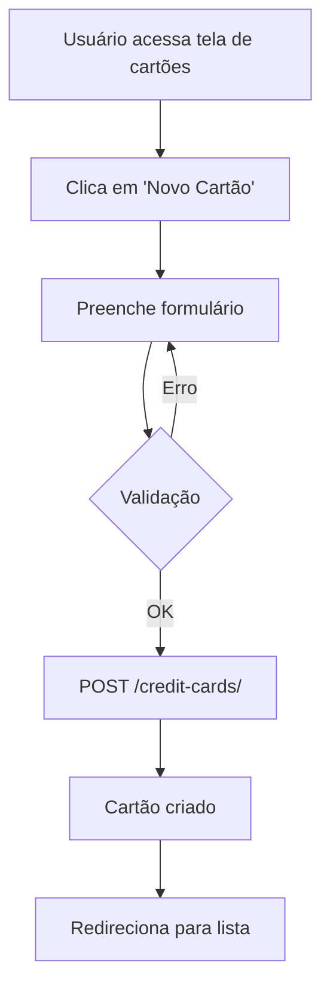
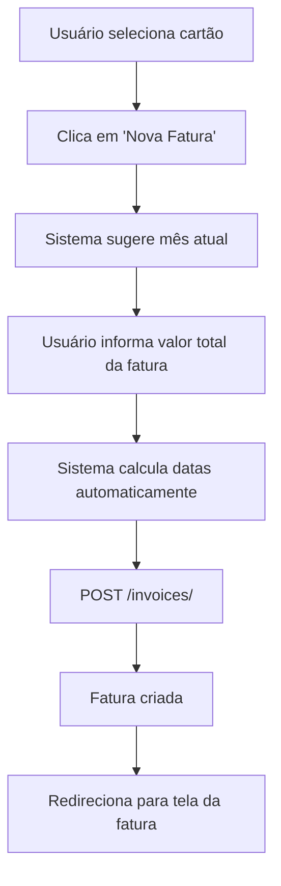
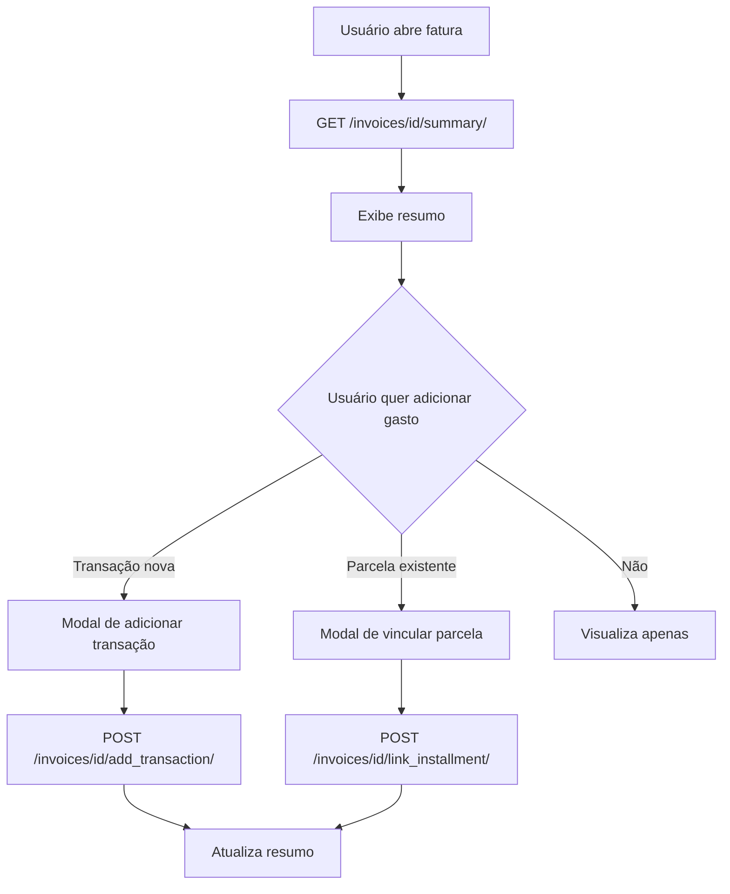
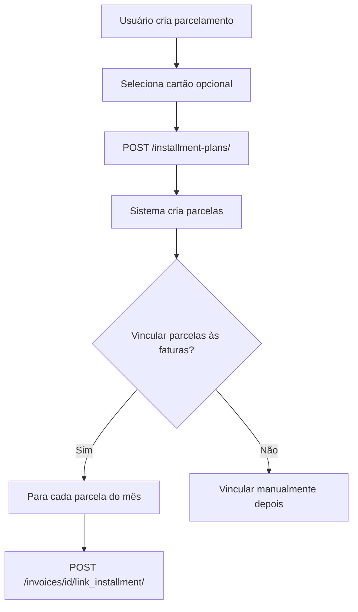
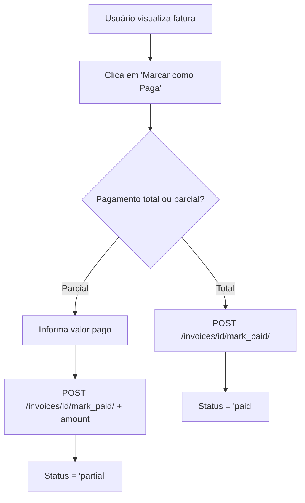

# 💳 Feature: Cartões de Crédito - Documentação para Frontend

## 📋 Índice

1. [Visão Geral](#visão-geral)
2. [Modelos de Dados](#modelos-de-dados)
3. [Endpoints da API](#endpoints-da-api)
4. [Fluxos de Trabalho](#fluxos-de-trabalho)
5. [Exemplos de Uso](#exemplos-de-uso)
6. [Tela de Fatura (Mockup)](#tela-de-fatura)

---

## 🎯 Visão Geral

A feature de **Cartões de Crédito** permite que o usuário:

- ✅ Cadastre seus cartões de crédito
- ✅ Crie faturas mensais para cada cartão
- ✅ Vincule transações e parcelamentos às faturas
- ✅ Visualize gastos declarados vs não declarados
- ✅ Controle pagamentos de faturas
- ✅ Gerencie múltiplos cartões simultaneamente

### Conceitos Principais

**Cartão de Crédito (`CreditCard`)**
- Representa um cartão físico/virtual
- Possui dia de fechamento e vencimento
- Pode ter limite de crédito (opcional)

**Fatura (`CreditCardInvoice`)**
- Representa uma fatura mensal de um cartão
- Possui valor total (informado manualmente)
- Calcula automaticamente gastos declarados vs não declarados

**Gastos Declarados**
- Soma de todas as transações + parcelas vinculadas à fatura
- Permite controle detalhado do que foi gasto

**Gastos Não Relacionados**
- Diferença entre o total da fatura e os gastos declarados
- Indica valores ainda não detalhados no sistema

---

## 📊 Modelos de Dados

### 1. CreditCard (Cartão de Crédito)

```typescript
interface CreditCard {
  id: number;
  user: number;
  user_email: string; // read-only
  name: string; // Ex: "Nubank Platinum"
  brand: 'visa' | 'mastercard' | 'elo' | 'amex' | 'hipercard' | 'other';
  brand_display: string; // read-only
  closing_day: number; // 1-31
  due_day: number; // 1-31 (deve ser maior que closing_day)
  credit_limit: number | null; // Opcional
  is_active: boolean;
  notes: string | null;
  invoices_count: number; // read-only
  active_invoices_count: number; // read-only
  created_at: string; // ISO 8601
  updated_at: string; // ISO 8601
}
```

### 2. CreditCardInvoice (Fatura)

```typescript
interface CreditCardInvoice {
  id: number;
  credit_card: number; // ID do cartão
  credit_card_name: string; // read-only
  reference_month: string; // "YYYY-MM-01" (primeiro dia do mês)
  reference_month_display: string; // read-only "MM/YYYY"
  total_amount: number; // Valor total da fatura (informado manualmente)
  closing_date: string; // "YYYY-MM-DD"
  due_date: string; // "YYYY-MM-DD"
  status: 'pending' | 'paid' | 'overdue' | 'partial';
  status_display: string; // read-only
  payment_date: string | null; // "YYYY-MM-DD"
  paid_amount: number; // Valor já pago
  declared_expenses: number; // read-only (calculado)
  unrelated_expenses: number; // read-only (calculado)
  remaining_balance: number; // read-only (calculado)
  notes: string | null;
  created_at: string; // ISO 8601
  updated_at: string; // ISO 8601
}
```

### 3. CreditCardInvoiceDetail (Fatura Detalhada)

Estende `CreditCardInvoice` com:

```typescript
interface CreditCardInvoiceDetail extends CreditCardInvoice {
  transactions: TransactionListItem[]; // Lista de transações vinculadas
  installments: InstallmentItem[]; // Lista de parcelas vinculadas
}
```

### 4. Transaction (atualizada)

Campos adicionados:

```typescript
interface Transaction {
  // ... campos existentes ...
  credit_card: number | null; // ID do cartão (opcional)
  credit_card_name: string | null; // read-only
  invoice: number | null; // ID da fatura (opcional)
  invoice_reference: string | null; // read-only
}
```

### 5. InstallmentPlan (atualizada)

Campos adicionados:

```typescript
interface InstallmentPlan {
  // ... campos existentes ...
  credit_card: number | null; // ID do cartão (opcional)
  credit_card_name: string | null; // read-only
}
```

### 6. Installment (atualizada)

Campos adicionados:

```typescript
interface Installment {
  // ... campos existentes ...
  invoice: number | null; // ID da fatura (opcional)
  invoice_reference: string | null; // read-only
}
```

---

## 🔌 Endpoints da API

Base URL: `/api/`

### Cartões de Crédito

#### Listar Cartões
```http
GET /api/credit-cards/
```

**Response:**
```json
[
  {
    "id": 1,
    "name": "Nubank Platinum",
    "brand": "mastercard",
    "brand_display": "Mastercard",
    "closing_day": 10,
    "due_day": 15,
    "credit_limit": 10000.00,
    "is_active": true,
    "invoices_count": 5,
    "active_invoices_count": 2,
    "created_at": "2024-10-01T10:00:00Z"
  }
]
```

#### Criar Cartão
```http
POST /api/credit-cards/
```

**Payload:**
```json
{
  "name": "Nubank Platinum",
  "brand": "mastercard",
  "closing_day": 10,
  "due_day": 15,
  "credit_limit": 10000.00,
  "is_active": true,
  "notes": "Cartão principal"
}
```

#### Buscar Cartão
```http
GET /api/credit-cards/{id}/
```

#### Atualizar Cartão
```http
PATCH /api/credit-cards/{id}/
```

#### Deletar Cartão
```http
DELETE /api/credit-cards/{id}/
```

#### Listar Apenas Cartões Ativos
```http
GET /api/credit-cards/active/
```

#### Ativar Cartão
```http
POST /api/credit-cards/{id}/activate/
```

#### Desativar Cartão
```http
POST /api/credit-cards/{id}/deactivate/
```

#### Listar Faturas do Cartão
```http
GET /api/credit-cards/{id}/invoices/
```

#### Resumo do Cartão
```http
GET /api/credit-cards/{id}/summary/
```

**Response:**
```json
{
  "card_id": 1,
  "card_name": "Nubank Platinum",
  "brand": "Mastercard",
  "is_active": true,
  "credit_limit": 10000.00,
  "total_invoices": 5,
  "pending_invoices": 2,
  "paid_invoices": 3,
  "overdue_invoices": 0,
  "total_transactions": 15,
  "total_installment_plans": 3
}
```

---

### Faturas

#### Listar Faturas
```http
GET /api/invoices/
```

**Query Params:**
- `?ordering=-reference_month` (mais recentes primeiro)
- `?search=nubank` (buscar por nome do cartão)

#### Criar Fatura
```http
POST /api/invoices/
```

**Payload:**
```json
{
  "credit_card": 1,
  "reference_month": "2024-10-01",
  "total_amount": 5000.00,
  "closing_date": "2024-10-10",
  "due_date": "2024-10-15",
  "status": "pending",
  "notes": "Fatura de outubro"
}
```

#### Buscar Fatura (Detalhada)
```http
GET /api/invoices/{id}/
```

**Response:**
```json
{
  "id": 1,
  "credit_card": 1,
  "credit_card_name": "Nubank Platinum",
  "reference_month": "2024-10-01",
  "reference_month_display": "10/2024",
  "total_amount": 5000.00,
  "declared_expenses": 3200.00,
  "unrelated_expenses": 1800.00,
  "paid_amount": 0.00,
  "remaining_balance": 5000.00,
  "closing_date": "2024-10-10",
  "due_date": "2024-10-15",
  "status": "pending",
  "transactions": [
    {
      "id": 10,
      "description": "Supermercado",
      "category_name": "Alimentação",
      "amount": 1000.00,
      "transaction_date": "2024-10-05"
    }
  ],
  "installments": [
    {
      "id": 5,
      "plan_description": "Notebook",
      "installment_number": 3,
      "amount": 800.00,
      "due_date": "2024-10-15"
    }
  ]
}
```

#### Atualizar Fatura
```http
PATCH /api/invoices/{id}/
```

#### Deletar Fatura
```http
DELETE /api/invoices/{id}/
```

#### Listar Faturas Pendentes
```http
GET /api/invoices/pending/
```

#### Listar Faturas Atrasadas
```http
GET /api/invoices/overdue/
```

#### Resumo da Fatura (Formato da Tela)
```http
GET /api/invoices/{id}/summary/
```

**Response:**
```json
{
  "invoice_id": 1,
  "credit_card": "Nubank Platinum",
  "reference_month": "10/2024",
  "closing_date": "2024-10-10",
  "due_date": "2024-10-15",
  "status": "pending",
  "total_amount": 5000.00,
  "declared_expenses": 3200.00,
  "unrelated_expenses": 1800.00,
  "paid_amount": 0.00,
  "remaining_balance": 5000.00,
  "transactions_count": 3,
  "installments_count": 2,
  "details": [
    {
      "type": "transaction",
      "id": 10,
      "name": "Supermercado",
      "category": "Alimentação",
      "amount": 1000.00
    },
    {
      "type": "installment",
      "id": 5,
      "name": "Notebook (3/10)",
      "category": "Eletrônicos",
      "amount": 800.00
    }
  ]
}
```

#### Marcar Fatura como Paga
```http
POST /api/invoices/{id}/mark_paid/
```

**Payload (opcional):**
```json
{
  "amount": 5000.00  // Se não informar, usa total_amount
}
```

#### Adicionar Transação à Fatura
```http
POST /api/invoices/{id}/add_transaction/
```

**Payload:**
```json
{
  "category": 1,
  "description": "Supermercado Extra",
  "amount": 1000.00,
  "transaction_date": "2024-10-15"
}
```

**Nota:** A transação será automaticamente vinculada ao cartão e à fatura, com type='expense'.

#### Vincular Parcela Existente à Fatura
```http
POST /api/invoices/{id}/link_installment/
```

**Payload:**
```json
{
  "installment_id": 123
}
```

---

## 🔄 Fluxos de Trabalho

### Fluxo 1: Cadastrar Novo Cartão



**Campos do formulário:**
- Nome do cartão (obrigatório)
- Bandeira (select: Visa, Mastercard, etc)
- Dia de fechamento (1-31)
- Dia de vencimento (1-31, deve ser > fechamento)
- Limite (opcional)
- Observações (opcional)

---

### Fluxo 2: Criar Fatura do Mês



**Lógica de cálculo de datas:**
```javascript
// Exemplo para outubro/2024, cartão fecha dia 10, vence dia 15
const referenceMonth = "2024-10-01"; // Primeiro dia do mês
const closingDate = "2024-10-10";    // Dia de fechamento
const dueDate = "2024-10-15";        // Dia de vencimento
```

---

### Fluxo 3: Detalhar Gastos da Fatura



---

### Fluxo 4: Criar Parcelamento no Cartão



**Exemplo de payload:**
```json
{
  "category": 2,
  "type": "expense",
  "description": "Notebook Dell",
  "credit_card": 1,  // <-- Vincula ao cartão
  "total_installments": 10,
  "default_amount": 500.00,
  "start_date": "2024-10-15"
}
```

---

### Fluxo 5: Pagar Fatura



---

## 💡 Exemplos de Uso

### Exemplo 1: Criar Cartão e Primeira Fatura

```javascript
// 1. Criar cartão
const card = await api.post('/api/credit-cards/', {
  name: 'Nubank Platinum',
  brand: 'mastercard',
  closing_day: 10,
  due_day: 15,
  credit_limit: 10000.00
});

// 2. Criar fatura de outubro
const invoice = await api.post('/api/invoices/', {
  credit_card: card.data.id,
  reference_month: '2024-10-01',
  total_amount: 5000.00,
  closing_date: '2024-10-10',
  due_date: '2024-10-15',
  status: 'pending'
});

// 3. Adicionar uma compra
await api.post(`/api/invoices/${invoice.data.id}/add_transaction/`, {
  category: 1,
  description: 'Supermercado',
  amount: 1000.00,
  transaction_date: '2024-10-05'
});

// 4. Ver resumo
const summary = await api.get(`/api/invoices/${invoice.data.id}/summary/`);
console.log(summary.data);
// {
//   total_amount: 5000.00,
//   declared_expenses: 1000.00,
//   unrelated_expenses: 4000.00,
//   ...
// }
```

---

### Exemplo 2: Criar Parcelamento no Cartão

```javascript
// 1. Criar plano de parcelamento vinculado ao cartão
const plan = await api.post('/api/installment-plans/', {
  category: 2,
  type: 'expense',
  description: 'Notebook Dell',
  credit_card: 1, // ID do cartão
  total_installments: 10,
  default_amount: 500.00,
  start_date: '2024-10-15'
});

// 2. Buscar parcelas criadas
const installments = await api.get(`/api/installment-plans/${plan.data.id}/installments/`);

// 3. Vincular parcela do mês à fatura
const octoberInstallment = installments.data.find(i => 
  i.due_date.startsWith('2024-10')
);

await api.post(`/api/invoices/1/link_installment/`, {
  installment_id: octoberInstallment.id
});
```

---

### Exemplo 3: Componente Vue de Resumo de Fatura

```vue
<template>
  <div class="invoice-summary">
    <!-- Header -->
    <div class="header">
      <h2>{{ invoice.credit_card }} - {{ invoice.reference_month }}</h2>
      <span :class="statusClass">{{ invoice.status_display }}</span>
    </div>

    <!-- Cards de Valores -->
    <div class="cards-grid">
      <div class="card total">
        <div class="icon">💳</div>
        <div class="content">
          <h3>Fatura Total</h3>
          <p class="value">{{ formatCurrency(invoice.total_amount) }}</p>
        </div>
      </div>

      <div class="card declared">
        <div class="icon">📋</div>
        <div class="content">
          <h3>Gastos Declarados</h3>
          <p class="value">{{ formatCurrency(invoice.declared_expenses) }}</p>
        </div>
      </div>

      <div class="card unrelated">
        <div class="icon">⚠️</div>
        <div class="content">
          <h3>Despesas Não Relacionadas</h3>
          <p class="value warning">{{ formatCurrency(invoice.unrelated_expenses) }}</p>
        </div>
      </div>
    </div>

    <!-- Tabela de Detalhes -->
    <div class="details">
      <h3>Detalhes</h3>
      <table>
        <thead>
          <tr>
            <th>Nome</th>
            <th>Categoria</th>
            <th>Valor</th>
            <th>Ações</th>
          </tr>
        </thead>
        <tbody>
          <tr v-for="item in invoice.details" :key="`${item.type}-${item.id}`">
            <td>{{ item.name }}</td>
            <td>{{ item.category }}</td>
            <td>{{ formatCurrency(item.amount) }}</td>
            <td>
              <button @click="editItem(item)">✏️</button>
              <button @click="deleteItem(item)">🗑️</button>
            </td>
          </tr>
        </tbody>
      </table>
    </div>

    <!-- Botão Adicionar -->
    <button class="btn-add" @click="showAddModal = true">
      Adicionar gasto ou parcela
    </button>
  </div>
</template>

<script setup>
import { ref, onMounted } from 'vue';
import { useRoute } from 'vue-router';
import api from '@/services/api';

const route = useRoute();
const invoice = ref({});
const showAddModal = ref(false);

onMounted(async () => {
  const { data } = await api.get(`/api/invoices/${route.params.id}/summary/`);
  invoice.value = data;
});

const formatCurrency = (value) => {
  return new Intl.NumberFormat('pt-BR', {
    style: 'currency',
    currency: 'BRL'
  }).format(value);
};

const editItem = (item) => {
  // Implementar edição
};

const deleteItem = (item) => {
  // Implementar exclusão
};
</script>
```

---

## 🎨 Tela de Fatura (Mockup)

### Layout Proposto

```
┌─────────────────────────────────────────────────────────────┐
│  Cartão de Crédito - Despesas da Fatura                    │
│  Nubank Platinum - 10/2024                      [Pendente]  │
└─────────────────────────────────────────────────────────────┘

┌──────────────┐  ┌──────────────┐  ┌──────────────────────┐
│   💳         │  │   📋         │  │   ⚠️                 │
│ Fatura Total │  │   Gastos     │  │   Despesas Não       │
│              │  │  Declarados  │  │   Relacionadas       │
│ R$ 5.000,00  │  │ R$ 3.200,00  │  │   R$ 1.800,00        │
└──────────────┘  └──────────────┘  └──────────────────────┘

┌─────────────────────────────────────────────────────────────┐
│ Detalhes                                                    │
├───────────────────┬──────────────┬──────────┬──────────────┤
│ Nome              │ Categoria    │ Valor    │ Ações        │
├───────────────────┼──────────────┼──────────┼──────────────┤
│ Supermercado      │ Alimentação  │ R$ 1.000 │ ✏️  🗑️      │
│ Eletrônicos       │ Compras      │ R$ 800   │ ✏️  🗑️      │
│ Academia          │ Saúde        │ R$ 200   │ ✏️  🗑️      │
│ Notebook (3/10)   │ Eletrônicos  │ R$ 500   │ ✏️  🗑️      │
└───────────────────┴──────────────┴──────────┴──────────────┘

           [+ Adicionar gasto ou parcela]
```

### Componentes Recomendados

1. **InvoiceCard** - Card de valor (total, declarado, não relacionado)
2. **InvoiceDetailsTable** - Tabela de transações e parcelas
3. **AddExpenseModal** - Modal para adicionar transação
4. **LinkInstallmentModal** - Modal para vincular parcela existente
5. **InvoiceSummaryView** - Tela principal

---

## 🔐 Validações Frontend

### Cartão de Crédito

```javascript
const validateCard = (card) => {
  const errors = {};
  
  if (!card.name || card.name.trim().length < 3) {
    errors.name = 'Nome deve ter pelo menos 3 caracteres';
  }
  
  if (!card.brand) {
    errors.brand = 'Selecione uma bandeira';
  }
  
  if (card.closing_day < 1 || card.closing_day > 31) {
    errors.closing_day = 'Dia deve estar entre 1 e 31';
  }
  
  if (card.due_day <= card.closing_day) {
    errors.due_day = 'Vencimento deve ser após o fechamento';
  }
  
  if (card.credit_limit && card.credit_limit <= 0) {
    errors.credit_limit = 'Limite deve ser maior que zero';
  }
  
  return errors;
};
```

### Fatura

```javascript
const validateInvoice = (invoice) => {
  const errors = {};
  
  if (!invoice.credit_card) {
    errors.credit_card = 'Selecione um cartão';
  }
  
  if (!invoice.total_amount || invoice.total_amount < 0) {
    errors.total_amount = 'Valor total deve ser maior ou igual a zero';
  }
  
  if (invoice.paid_amount > invoice.total_amount) {
    errors.paid_amount = 'Valor pago não pode exceder o total';
  }
  
  return errors;
};
```

---

## 📱 Estados da UI

### Cores dos Status

```css
.status-pending {
  background: #fbbf24; /* amarelo */
  color: #78350f;
}

.status-paid {
  background: #10b981; /* verde */
  color: #064e3b;
}

.status-overdue {
  background: #ef4444; /* vermelho */
  color: #7f1d1d;
}

.status-partial {
  background: #3b82f6; /* azul */
  color: #1e3a8a;
}
```

### Alertas

- **Gastos Não Relacionados > 0**: Mostrar alerta amarelo sugerindo adicionar detalhes
- **Fatura Atrasada**: Mostrar alerta vermelho
- **Fatura Paga**: Mostrar badge verde

---

## 🚀 Próximos Passos

1. **Criar migrations**: `python manage.py makemigrations && python manage.py migrate`
2. **Testar endpoints**: Use Postman ou Insomnia
3. **Implementar componentes Vue**: Seguir estrutura proposta
4. **Adicionar testes**: Jest/Vitest para componentes
5. **Melhorias futuras**:
   - Automação de criação de faturas
   - Notificações de vencimento
   - Gráficos de gastos por categoria
   - Exportação de faturas (PDF)

---

## 📞 Suporte

Para dúvidas ou problemas:
- Verifique logs do backend: `python manage.py runserver`
- Teste endpoints manualmente
- Valide dados enviados

---

**Documentação gerada em:** Outubro 2024  
**Versão da API:** 1.0  
**Backend:** Django REST Framework  
**Frontend:** Vue.js 3

